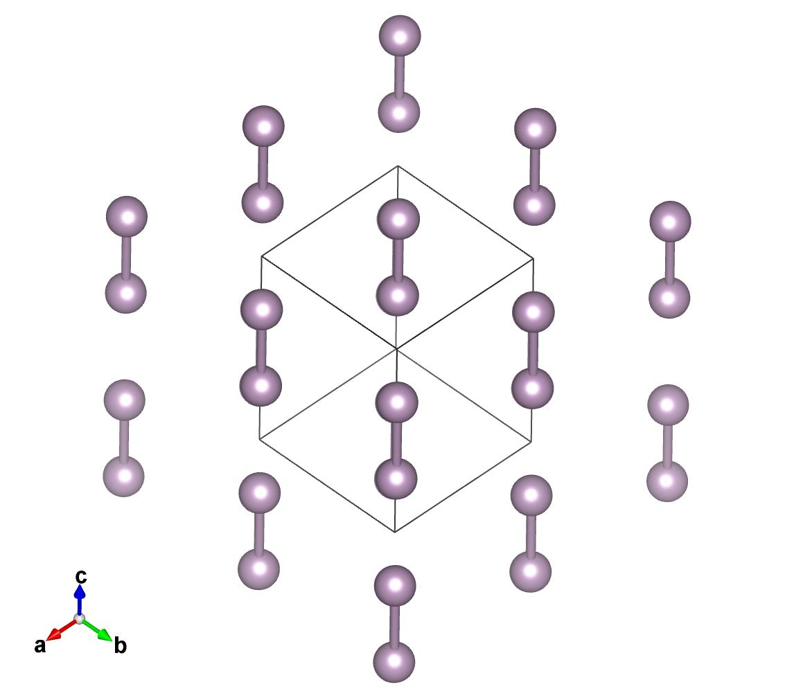
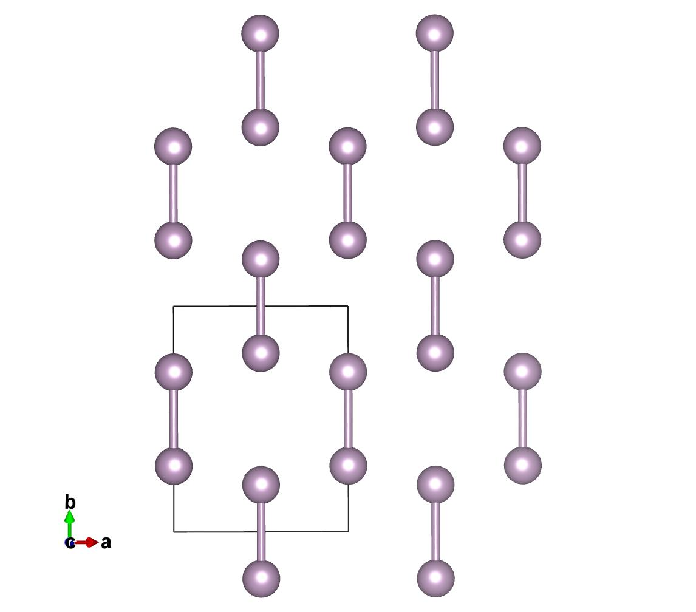

PyChemia CookBook
-----------------

This is a set of small recipes for getting the 'job done' quickly
using the methods and classes implemented on PyChemia

.. toctree::
    :maxdepth: 4

    51.Euler_Angles

Reading a formula and extracting the composition
~~~~~~~~~~~~~~~~~~~~~~~~~~~~~~~~~~~~~~~~~~~~~~~~

Consider that you have a formula such as 'YBa2Cu3O7' and you would like
to get the composition and the number of atoms of each species.
The recipe is very simple:

    >>> import pychemia
    >>> formula = 'YBa2Cu3O7'
    >>> comp = pychemia.Composition(formula)
    >>> comp['Ba']
    2

The Composition object acts like a python dictionary, with the particularity of returning 0 when we ask for species
non present on a given composition:

    >>> comp['Au']
    0

Converting an ascii file into a POSCAR
~~~~~~~~~~~~~~~~~~~~~~~~~~~~~~~~~~~~~~

Consider the following ascii file stored on ``test.ascii``:

.. code-block:: none

    None
    11.47012476778924 0.79937702290141 9.51246277071292
    -2.99939838492446 -0.12947182393907 7.79142604544631
       0.6793241103939325 -0.0865078526005124  5.2059167421975845  Mg
       7.2961243488047218  7.8694796435395364  5.3644840894866279  Mg
       2.9186811537636199  0.3979635592494910  1.4510323645408516  Ca
      -0.9269026176064651  2.5195450955593404  2.9685499969876323  Ca
      -0.8684364924472798  6.8223765997007311  5.7332541305138323  Ca
       7.7311137749974712  6.1831255116012693  0.0000000000000000  Ca

This is how pychemia can convert it into a POSCAR file:

    >>> import pychemia
    >>> st = pychemia.io.ascii.load('test.ascii')
    >>> pychemia.code.vasp.write_poscar(st, 'POSCAR.test')

The final archive called ``POSCAR.test`` will looks like this:

.. code-block:: none

     Mg Ca
    1.0
      11.4701247677892404   0.0000000000000000   0.0000000000000000
       0.7993770229014100   9.5124627707129203   0.0000000000000000
      -2.9993983849244601  -0.1294718239390700   7.7914260454463102
     Mg Ca
     2 4
    Direct
       0.2339469912681612   1.0000000000000000   0.6681596811459407
       0.7578333625215485   0.8366521516169854   0.6885111991304717
       0.3000667985403045   0.0443708102021889   0.1862345039376849
       0.0000000000000000   0.2700535286675975   0.3810021400026761
       0.0660256684506364   0.7272193856947440   0.7358414360955946
       0.6287217253130448   0.6500025977119140   0.0000000000000000

Compute the hardness of a given structure
~~~~~~~~~~~~~~~~~~~~~~~~~~~~~~~~~~~~~~~~~

Compute the ideal strength
~~~~~~~~~~~~~~~~~~~~~~~~~~

Read and Write structures between several atomistic codes
~~~~~~~~~~~~~~~~~~~~~~~~~~~~~~~~~~~~~~~~~~~~~~~~~~~~~~~~~

Search for structures from the PyChemia database
~~~~~~~~~~~~~~~~~~~~~~~~~~~~~~~~~~~~~~~~~~~~~~~~

Generate and manipulate VASP input files
~~~~~~~~~~~~~~~~~~~~~~~~~~~~~~~~~~~~~~~~

Convergence studies for VASP
~~~~~~~~~~~~~~~~~~~~~~~~~~~~

Read and write the input from an atomistic code
~~~~~~~~~~~~~~~~~~~~~~~~~~~~~~~~~~~~~~~~~~~~~~~

Read the output from an atomistic code
~~~~~~~~~~~~~~~~~~~~~~~~~~~~~~~~~~~~~~

Build an manipulate the lattice
~~~~~~~~~~~~~~~~~~~~~~~~~~~~~~~

Rotate the cell along a Miller index
~~~~~~~~~~~~~~~~~~~~~~~~~~~~~~~~~~~~

Very often for creating surfaces we need to rotate the structure along specific Miller indices.
We can achieve this with a routine for that, see this example::

    import pychemia
    pychemia_path = pychemia.__path__[0]
    st=pychemia.code.vasp.read_poscar(pychemia_path + '/test/data/vasp_06/POSCAR')
    st2=pychemia.analysis.surface.rotate_along_indices(st, 1,1,1, 2)

Both structures represent the same crystal, the second structure has the 'c' axis parallel to the 111 Miller direction.
Additionally we ask for having 2 layers of the cristal along the 'c' axis. We can check that the symmetry of the crystal
remains the same::

    sym=pychemia.crystal.CrystalSymmetry(st)
    sym.number()
    139

    sym=pychemia.crystal.CrystalSymmetry(st2)
    sym.number()
    139

Here you see the result of the two structures, the original and the rotated along the 111 axis.

Get the spatial group
~~~~~~~~~~~~~~~~~~~~~

Lets start reading a POSCAR for a Carbon diamond structure::

    import pychemia
    pychemia_path = pychemia.__path__[0]
    st=pychemia.code.vasp.read_poscar(pychemia_path + '/test/data/vasp_08/POSCAR_old')
    print(st)

You should get::

    2

     Symb  (             Positions            ) [     Cell-reduced coordinates     ]
        C  (     0.0000     0.0000     0.0000 ) [     0.0000     0.0000     0.0000 ]
        C  (     0.9250     0.9250     0.9250 ) [     0.2500     0.2500     0.2500 ]

    Periodicity:  X Y Z

    Lattice vectors:
         1.8500     1.8500     0.0000
         0.0000     1.8500     1.8500
         1.8500     0.0000     1.8500

PyChemia uses spglib to get the space-group and use some other routines to get the primitive and convectional cells and
to reposition the atoms to precise positions for a given symmetry. All this functionality is provided by creating
``CrystalSymmetry`` object::

    sym=pychemia.crystal.CrystalSymmetry(st)

We can get space groups using the number::

    sym.number()
    227

Or as internation symbol::

    sym.symbol()
    'Fd-3m'

In both cases, there is a tolerance that can be adjusted, the default value is 1e-5 that could be too strong for
structures produced by DFT calculations with crude relaxations.

To exemplify this situation consider this structure (Zn2V2O7) whit positions truncated to 4 decimals::

    st = pychemia.code.vasp.read_poscar(pychemia_path + '/test/data/vasp_07/POSCAR_trunc')
    sym = pychemia.crystal.CrystalSymmetry(st)
    sym.number()

You will get space group equal to 9, however adjusting the tolerance you will get the value from the precise structure::

    sym.number(1E-2)
    15

And the same works for the symbol::

    sym.symbol(1E-2)
    'C2/c'

Get the primitive cell
~~~~~~~~~~~~~~~~~~~~~~

The primitive cell is obtained from the ``CrystalSymmetry`` object again using the functionality of the spglib
library::

    import pychemia
    pychemia_path = pychemia.__path__[0]
    st = pychemia.code.vasp.read_poscar(pychemia_path + '/test/data/vasp_06/POSCAR')
    sym = pychemia.crystal.CrystalSymmetry(st)
    print(st)

The structure looks like this::

        4

     Symb  (             Positions            ) [     Cell-reduced coordinates     ]
        P  (     0.0000     0.0000     3.7190 ) [     0.0000     0.0000     0.7078 ]
        P  (     0.0000     0.0000     1.5350 ) [     0.0000     0.0000     0.2922 ]
        P  (     2.0308     2.0308     1.0920 ) [     0.5000     0.5000     0.2078 ]
        P  (     2.0308     2.0308     4.1620 ) [     0.5000     0.5000     0.7922 ]

    Periodicity:  X Y Z

    Lattice vectors:
         4.0616     0.0000     0.0000
         0.0000     4.0616     0.0000
         0.0000     0.0000     5.2540

We can get the primitive like this (eventually using a tolerance as an argument)::

    stp = sym.find_primitive()
    print(stp)

And the structure is reduced to a cell with just 2 atoms::

    2

     Symb  (             Positions            ) [     Cell-reduced coordinates     ]
        P  (     0.0000     0.0000     1.5350 ) [     0.2922     0.2922     0.0000 ]
        P  (     0.0000     0.0000     3.7190 ) [     0.7078     0.7078     0.0000 ]

    Periodicity:  X Y Z

    Lattice vectors:
        -2.0308     2.0308     2.6270
         2.0308    -2.0308     2.6270
         2.0308     2.0308    -2.6270

Get the conventional cell
~~~~~~~~~~~~~~~~~~~~~~~~~

The conventional cell is obtained as a result of the refinement of the cell, ie adjusting the positions precisely to
satisfy a given tolerance. From the previous section, lets reconstruct a convectional cell from the primitive::

    sym = pychemia.crystal.CrystalSymmetry(stp)
    stc = sym.refine_cell()
    print(stc)

You should get::

    4

     Symb  (             Positions            ) [     Cell-reduced coordinates     ]
        P  (     0.0000     0.0000     1.5350 ) [     0.0000     0.0000     0.2922 ]
        P  (     0.0000     0.0000     3.7190 ) [     0.0000     0.0000     0.7078 ]
        P  (     2.0308     2.0308     4.1620 ) [     0.5000     0.5000     0.7922 ]
        P  (     2.0308     2.0308     1.0920 ) [     0.5000     0.5000     0.2078 ]

    Periodicity:  X Y Z

    Lattice vectors:
         4.0616     0.0000     0.0000
         0.0000     4.0616     0.0000
         0.0000     0.0000     5.2540

Now lets refine the structure with positions truncated and reconstruct a cell with positions precisely in place to the
symmetry found::

    st = pychemia.code.vasp.read_poscar(pychemia_path + '/test/data/vasp_07/POSCAR_trunc')
    sym = pychemia.crystal.CrystalSymmetry(st)
    st2 = sym.refine_cell(1E-2)
    sym = pychemia.crystal.CrystalSymmetry(st2)

Here we took the structure with positions truncated, and refined the cell using a tolerance that return the an space
group 15, after that we create a new ``CrystalSymmetry`` object from the new structure and we can verify that the space
group is preserved up to very strict tolerances::

    sym.number()
    15

    sym.number(1E-14)
    15

